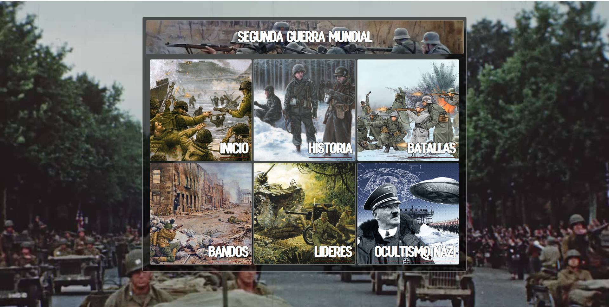

<h1  align="center">Segunda Guerra Mundial</h1>

  

 Esta página esta dedicada a explorar la historia de la Segunda Guerra Mundial, diseñada como un proyecto de desarrollo web en constante evolución. Este sitio no solo ofrece contenido histórico fascinante, sino que también refleja el aprendizaje práctico de HTML, CSS y     
 JavaScript en acción. Cada sección está diseñada cuidadosamente para combinar el rigor histórico con las mejores prácticas del desarrollo web, convirtiéndose en un espacio donde la tecnología y la historia se encuentran.

